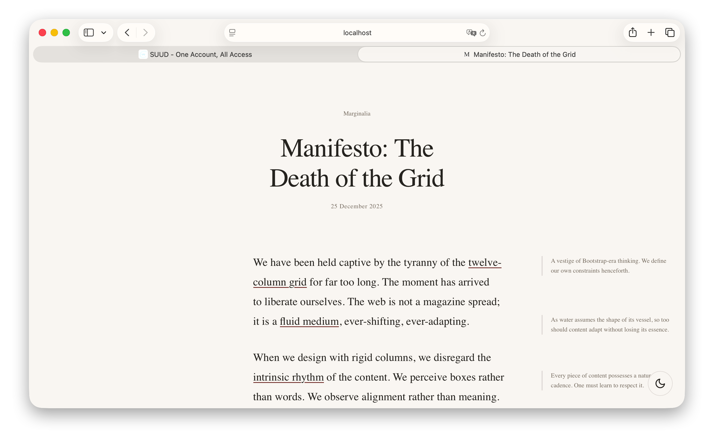
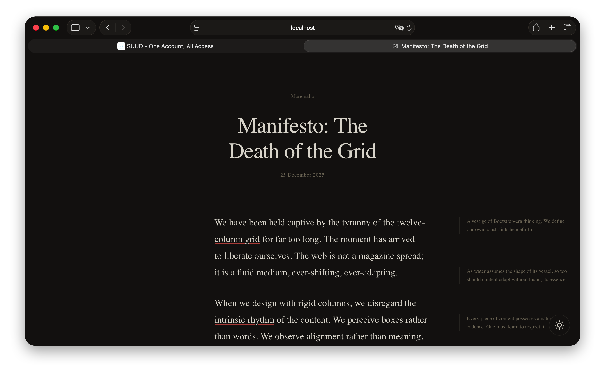
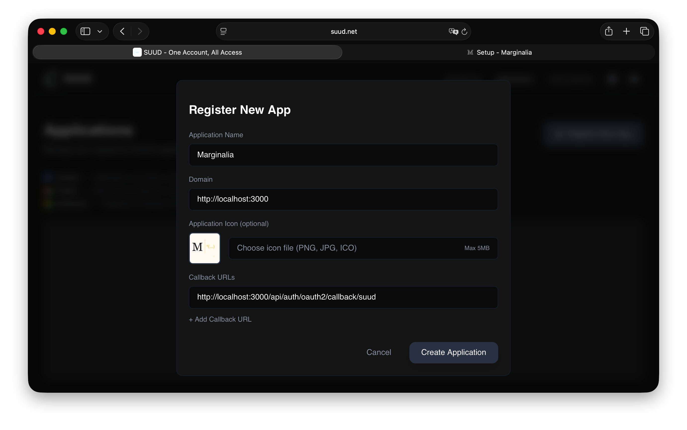
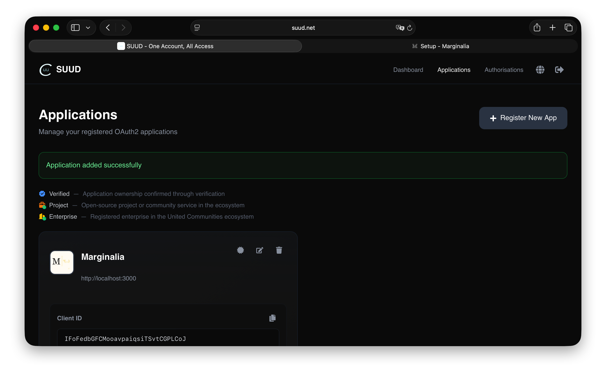
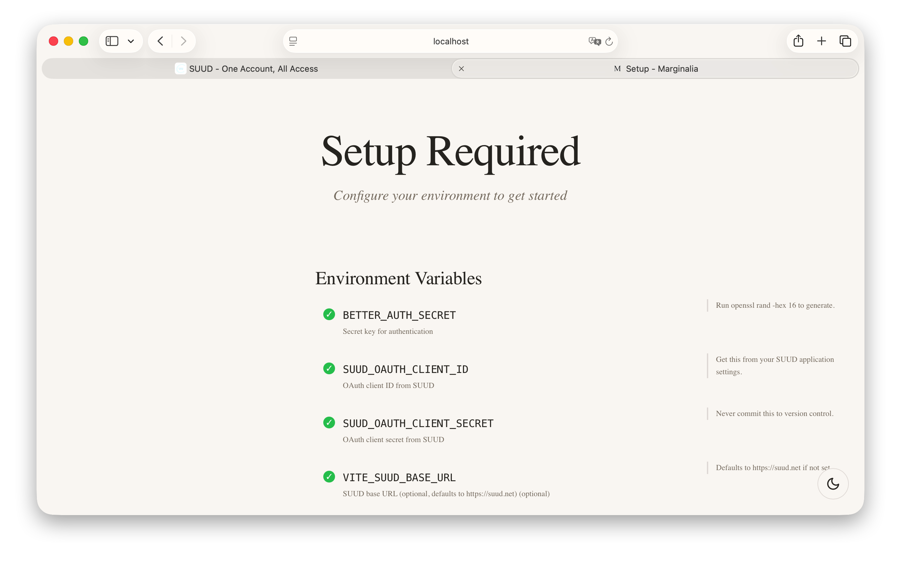
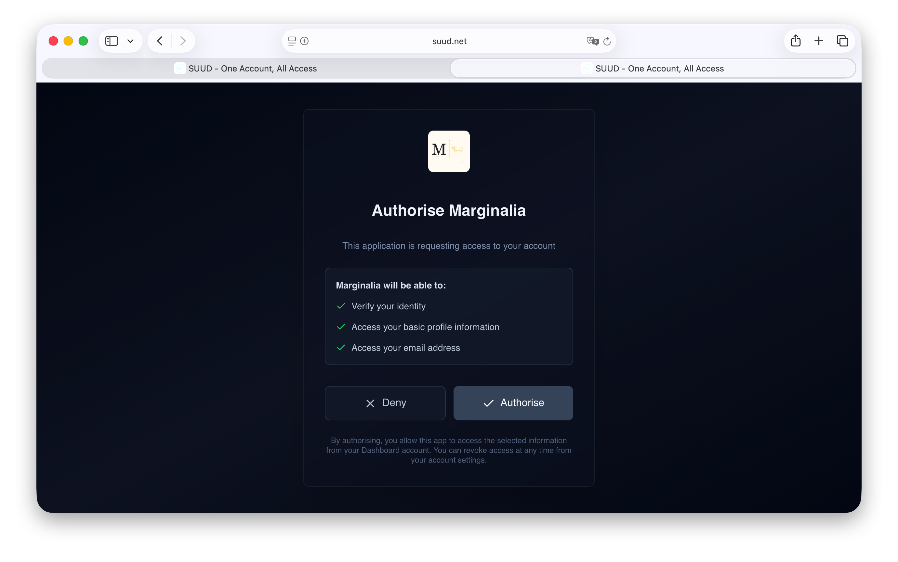
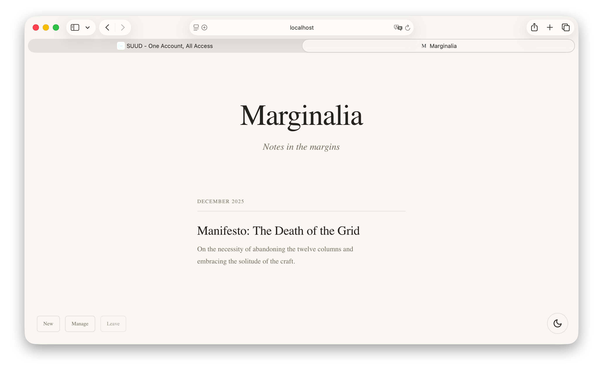

# Marginalia

*Notes in the margins.*

A contemplative writing platform where marginalia—those whispered asides in the margins of manuscripts—find their digital incarnation.





## Philosophy

Marginalia rejects the tyranny of the twelve-column grid. It embraces the relationship between text and margin, between reader and white space. Every pixel exists in service of the word.

## Features

- **Marginalia syntax** — `||context||(note)` transforms inline text into elegant sidenotes
- **Fluid typography** — A perfect fourth scale (1.333) with Newsreader serif
- **Responsive margins** — Desktop: persistent sidebar; Mobile: inline disclosure
- **Light & dark modes** — "Morning read" and "Lamplight" palettes
- **SUUD authentication** — SSO with [SUUD (Simplified Universal User Dashboard)](https://suud.net) via OAuth2
- **First-login ownership** — The first person to authenticate becomes the administrator

## Getting Started

### 1. Register application on SUUD

Before configuring Marginalia, you need OAuth credentials from SUUD.

1. Go to [suud.net](https://suud.net) and create an account
2. Navigate to **Applications** and click **Register New App**
3. Fill in the application details:
   - **Application Name**: `Marginalia` (or your preferred name)
   - **Domain**: `http://localhost:3000` (for development)
   - **Callback URL**: `http://localhost:3000/api/auth/oauth2/callback/suud`



4. After creation, copy the **Client ID** and **Client Secret**



### 2. Install dependencies

```bash
bun i
```

### 3. Configure environment

Create `.env` or `.env.local` in the project root with the credentials from step 1:

```bash
BETTER_AUTH_SECRET=your-secret-key

VITE_BASE_URL=http://localhost:3000
VITE_SUUD_BASE_URL=https://suud.net

SUUD_OAUTH_CLIENT_ID=your-client-id
SUUD_OAUTH_CLIENT_SECRET=your-client-secret
```

| Variable | Description |
|----------|-------------|
| `BETTER_AUTH_SECRET` | Run `openssl rand -hex 16` to generate |
| `SUUD_OAUTH_CLIENT_ID` | From your SUUD application |
| `SUUD_OAUTH_CLIENT_SECRET` | From your SUUD application |
| `VITE_SUUD_BASE_URL` | Optional, defaults to `https://suud.net` |

### 4. Start development server

```bash
bun dev
```

### 5. Verify configuration

Visit [localhost:3000/install](http://localhost:3000/install) to verify all environment variables are configured correctly.



### 6. Claim ownership

1. Click **Authenticate** to login with SUUD
2. Authorise the application when prompted



3. The first person to authenticate automatically becomes the administrator
4. You will see **New** and **Manage** buttons on the homepage



## Writing with Marginalia

```markdown
We have been imprisoned by the ||twelve-column grid||(A vestige of
Bootstrap-era thinking.) for far too long.
```

The text within `||..||` becomes the trigger; the text within `(..)` becomes the note.

## Project Structure

```
Marginalia/
├── src/
│   ├── routes/
│   │   ├── __root.tsx            # Root layout
│   │   ├── index.tsx             # Timeline of writings
│   │   ├── dashboard.tsx         # Post management
│   │   ├── editor.tsx            # Writing studio
│   │   ├── install.tsx           # Setup wizard
│   │   ├── settings.tsx          # Site configuration
│   │   ├── writings/$slug.tsx    # Individual pieces
│   │   └── api/                  # API routes
│   ├── components/               # React components
│   ├── hooks/                    # Custom hooks
│   ├── lib/                      # Core utilities
│   └── styles/                   # CSS files
├── drizzle/                      # Database migrations
├── data/                         # SQLite database (gitignored)
└── docs/                         # README images (safe to delete)
```

## Stack

- TanStack Start with Vite 7 + Nitro
- React 19 / TypeScript 5.9
- Better Auth + SUUD (Simplified Universal User Dashboard) OAuth2.0
- Drizzle ORM + bun:sqlite
- Newsreader + Geist typefaces

## Commands

```bash
bun i                     # Install dependencies
bun dev                   # Development server (with bun:sqlite)
bun run build             # Production build
bun run start             # Start production server
bunx drizzle-kit migrate  # Run database migrations
bunx drizzle-kit studio   # Open Drizzle Studio GUI
```

## Verification

To verify ownership in SUUD, add a verification div to any post's content:

```html
<div data-suud-verification="your-token-here"></div>
```

The verification token will be extracted and rendered on the homepage.
